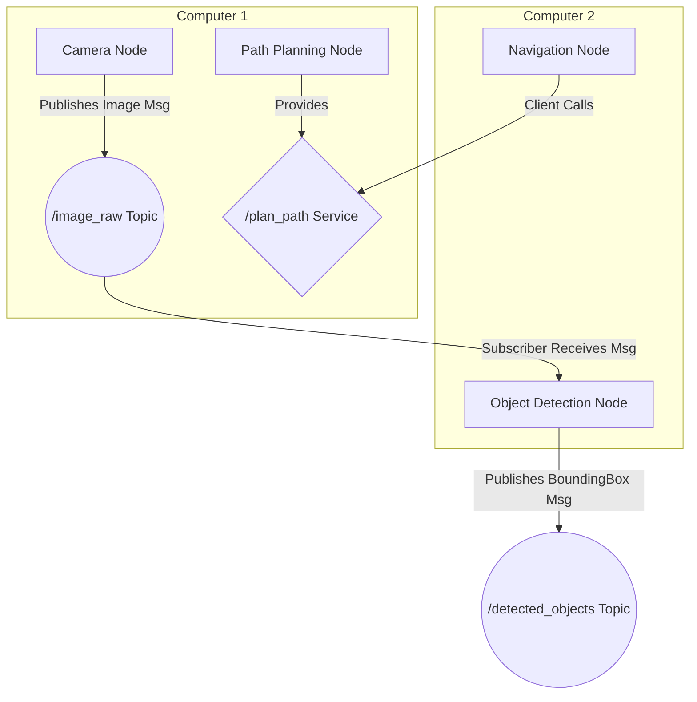

# Chapter 1: ROS 2 Fundamentals

Welcome to the "nervous system" of modern robotics. This chapter introduces the foundational concepts of the Robot Operating System 2 (ROS 2), the middleware that enables communication and data transfer between all the different software components of a robot.

## T001: Introduction
A robot, especially a humanoid, is an incredibly complex system. It has sensors to perceive the world, actuators to move, and a "brain" to make decisions. ROS 2 provides the critical communication backbone that allows these disparate parts to work together seamlessly, much like the nervous system in a biological organism. It enables modularity, so different teams can work on different components (vision, motion, navigation) independently.

## T002: Nodes: The Building Blocks
A **Node** is the primary building block of a ROS 2 system. Think of it as a single, self-contained program responsible for one specific task.
- A node for controlling the arm motors.
- A node for reading data from a camera.
- A node for planning a path.

Each node is an executable that runs as a separate process on the robot's computer or even across a network of computers.

## T003: Topics and Messages: The Data Stream
Nodes communicate by publishing and subscribing to **Topics**. A topic is like a named channel or a bus where data of a specific type is broadcast.
- **Publishers**: A node can have a publisher to send messages to a topic. For example, a camera node would publish images to an `/image_raw` topic.
- **Subscribers**: A node can have a subscriber to receive messages from a topic. For example, an object detection node would subscribe to the `/image_raw` topic to get images to process.

The data itself is structured as a **Message**, which has a defined type (e.g., `String`, `Int32`, or a custom type like `SensorData`).

## T004: Services: Request and Reply
While topics are great for continuous data streams, sometimes a node needs to request a specific action from another node and wait for a response. This is handled by **Services**.
- A service has a **Server** (in one node) that provides a capability.
- A service has a **Client** (in another node) that can call the server.
- Unlike topics, services are synchronous: the client sends a request and waits until the server sends back a response.
- Example: A path-planning node could provide a `/plan_path` service. Another node could call this service with a goal location and would receive the calculated path in response.

## T005: System Architecture Diagram

Here is a diagram illustrating how these components work together:

## T006: The Role of DDS
Under the hood, ROS 2 uses a technology called **DDS (Data Distribution Service)**. DDS is an industry standard for real-time, scalable, and reliable data exchange. You don't need to be a DDS expert to use ROS 2, but it's important to know that it's the technology that provides many of ROS 2's key features, including:
- **Discovery**: Nodes automatically find each other on the network.
- **Quality of Service (QoS)**: Fine-grained control over reliability, durability, and other communication parameters. This is critical for robotics where some data (like motor commands) must be reliable, while other data (like video feeds) can afford to drop a frame occasionally.
- **Platform Independence**: DDS allows ROS 2 to run on different operating systems and hardware.
