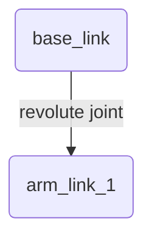

# Chapter 3: Humanoid Robot Description with URDF

We've learned how ROS 2 nodes communicate, but how do they know what the robot's body actually looks like? This is where the **Unified Robot Description Format (URDF)** comes in. URDF is an XML file format used in ROS to describe all the physical elements of a robot.

## T012: Introduction to URDF
A URDF file is like a blueprint for your robot. It defines:
- The robot's body parts (**links**).
- How the parts are connected and move relative to each other (**joints**).
- Where sensors are located.
- The physical properties of each part (mass, inertia, collision geometry).

ROS tools use this file to perform tasks like forward and inverse kinematics, run simulations in Gazebo, and visualize the robot's state in RViz2.

## T013: A Simplified URDF Example
Let's look at a very simple URDF for a two-link arm.

```xml
<!-- T013: simple_arm.urdf -->
<robot name="simple_arm">
  <!-- Links -->
  <link name="base_link">
    <visual>
      <geometry>
        <cylinder length="0.2" radius="0.1"/>
      </geometry>
    </visual>
  </link>

  <link name="arm_link_1">
    <visual>
      <geometry>
        <box size="0.5 0.1 0.1"/>
      </geometry>
      <origin xyz="0.25 0 0" rpy="0 0 0"/>
    </visual>
  </link>

  <!-- Joints -->
  <joint name="base_to_arm_1" type="revolute">
    <parent link="base_link"/>
    <child link="arm_link_1"/>
    <origin xyz="0 0 0.1" rpy="0 0 0"/>
    <axis xyz="0 0 1"/>
    <limit effort="300" velocity="1.0" lower="-1.57" upper="1.57" />
  </joint>
</robot>
```

## T014: Core URDF Tags: `<link>`, `<joint>`, and `<sensor>`
- **`<link>`**: This tag describes a rigid body part. The key sub-tags are `<visual>` (what it looks like), `<collision>` (its collision geometry for physics simulation), and `<inertial>` (its mass and rotational inertia).
- **`<joint>`**: This tag connects two links together. The `type` attribute is critical:
    - `revolute`: A hinge joint that rotates around an axis.
    - `prismatic`: A sliding joint that moves along an axis.
    - `fixed`: A rigid connection with no movement.
    The `<parent>` and `<child>` tags define the relationship between the two links.
- **`<sensor>`**: This tag is used to attach a sensor, like a camera or an IMU, to a specific link. It defines the sensor's type and its properties. (This tag is often used more in simulation-specific formats like SDF, but can be included in URDF).

## T015: Kinematic Chains
The series of links and joints connected together form a **kinematic chain**. A robot's URDF is essentially a tree of these chains, starting from a root link (often `base_link` or `torso`). ROS tools can use this tree structure to calculate the position of any link (like the hand) relative to any other link (like the base).

## T016: Kinematic Chain Diagram
The URDF above describes the following simple kinematic chain:


In a full humanoid, you would have many of these chains branching out from the torso to form the arms, legs, and head.
