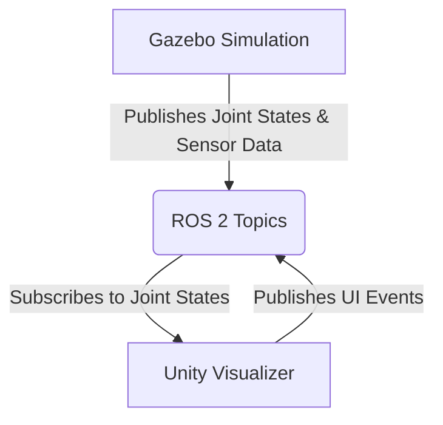

# Chapter 4: The Digital Twin

Welcome to the second module in our series on Physical AI and Humanoid Robotics. In this module, we'll dive deep into the concept of the **Digital Twin**.

A digital twin is a virtual model designed to accurately reflect a physical object. In our case, it's a virtual, physics-based representation of our humanoid robot and its environment.

This module will cover:
-   **Gazebo Physics**: Understanding how to simulate gravity, collisions, and dynamics.
-   **Unity Environments**: Using Unity for high-fidelity rendering and human-robot interaction.
-   **Sensor Simulation**: Adding virtual LiDAR, depth cameras, and IMUs to our robot.

## Architecture Overview

Here is the high-level data flow between the components we'll be using:

Below is a video showing the final result, with the Gazebo simulation on the left and the Unity visualizer on the right.

*(Placeholder for embedded video of the simulation)*
